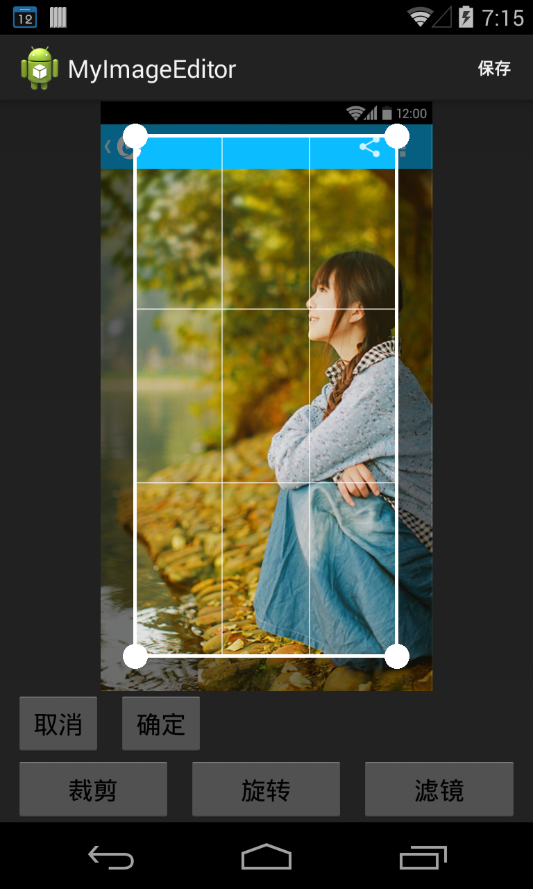

ImageCropRotateFilter
=====================

Android Bitmap Crop, Rotate, Filter...

#### Maybe Require:
1. `Android Studio` = 0.5.0
2. `Gradle` = 0.9.+
3. `RenderScript` Support v8
4. `buildToolsVersion` = 19.0.3

#### Screenshot:
###### 1. Crop

###### 2. Rotate

###### 3. Filter

